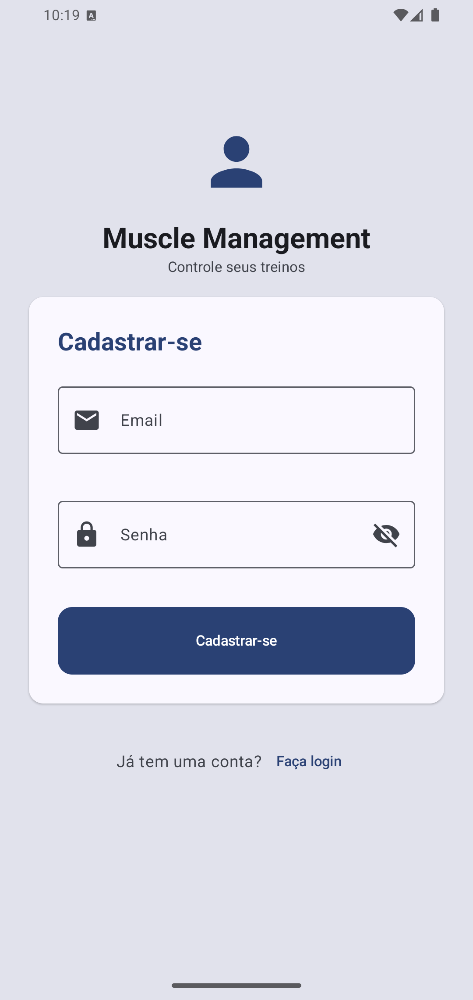
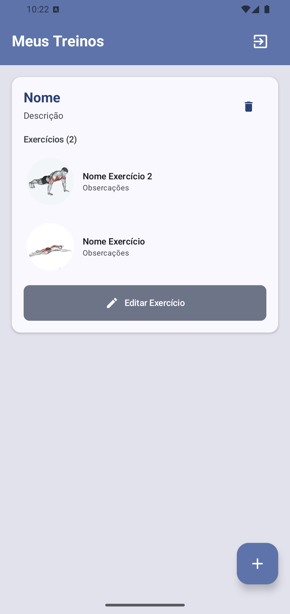
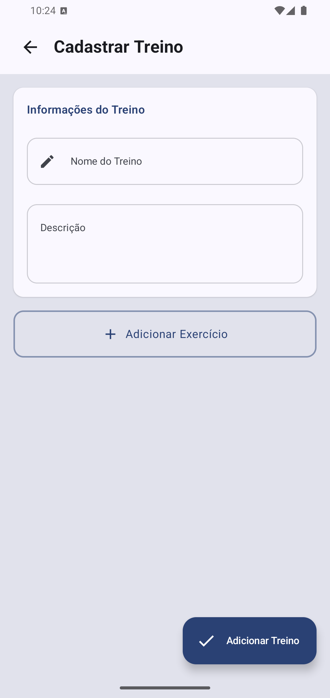
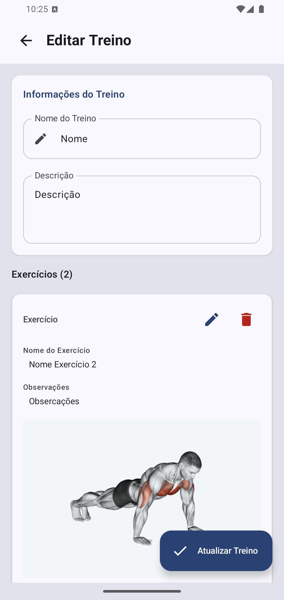

  

<h1 align="center">Muscle Management</h1>

  Aplicativo para <strong>acompanhamento de treinos</strong> desenvolvido para o processo seletivo da Leal Apps. 
  Gerencie suas <strong>rotinas de exercícios</strong> com sincronização em nuvem via Firebase.

## 📱 Telas do Aplicativo

  
  
  
  
  

## ⚙️ Funcionalidades

- **Autenticação de usuários** com Firebase Auth
- **CRUD completo** de treinos e exercícios
- **Relação 1-N** entre treinos e exercícios
- **Sincronização em nuvem** com Firestore
- **UI moderna** com Jetpack Compose
- **Padrão MVI** para gerenciamento de estado
- **Testes unitários** com MockK e JUnit

## 🛠️ Tecnologias Utilizadas

| Tecnologia | Descrição |
|------------|-----------|
| **Jetpack Compose** | UI 100% declarativa |
| **Firebase Auth** | Autenticação de usuários |
| **Firebase Firestore** | Banco de dados em nuvem |
| **Clean Architecture** | Separação de camadas |
| **Padrão MVI** | Fluxo unidirecional de dados |
| **Kotlin Coroutines** | Operações assíncronas |

## ⚠️ Disclaimer

O armazenamento de imagens via **Firebase Storage não foi implementado** devido às recentes mudanças nos planos do Firebase, que agora exigem a atualização para um plano pago para habilitar essa funcionalidade. A decisão foi tomada para manter o projeto dentro dos limites do plano gratuito.

## 📄 Licença

Este projeto foi desenvolvido exclusivamente para o processo seletivo da Leal Apps.

  <strong>© 2025 João Henrique de Souza Silva. Todos os direitos reservados.</strong>

